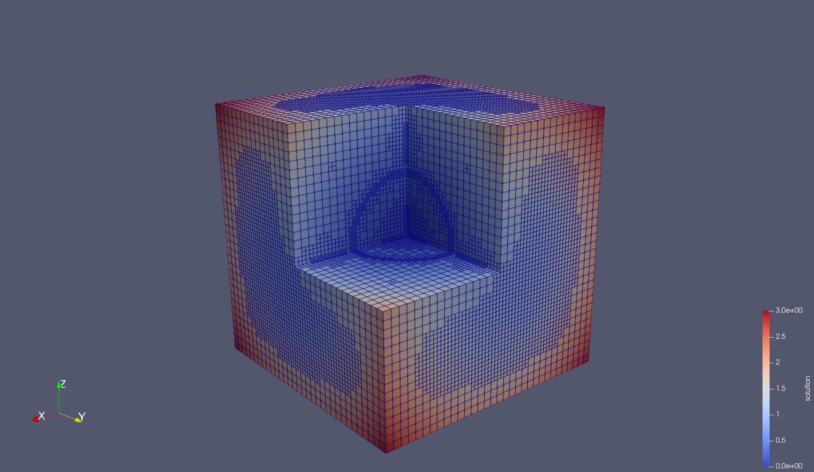

# dealii_practice
Test cases repo for the dealii C++ finite element library. Problems can be exported as C++ Eclipse project as follows:

- Create a CMakeLists.txt with 'target' the name of your problem.cc file.
From command line, type
- `cmake .` to detect C/CXX compilers
- `cmake -G "Eclipse CDT4 - Unix Makefiles" .` (don't miss the `.` at the end)

Now move to Eclipse IDE:

- File -> Import -> Existing Project into Workspace
- Browse directory of current project

You can compile and then run using targets or as usual from command line using make commands (see `make info` to know how to switch from debug/release mode)

